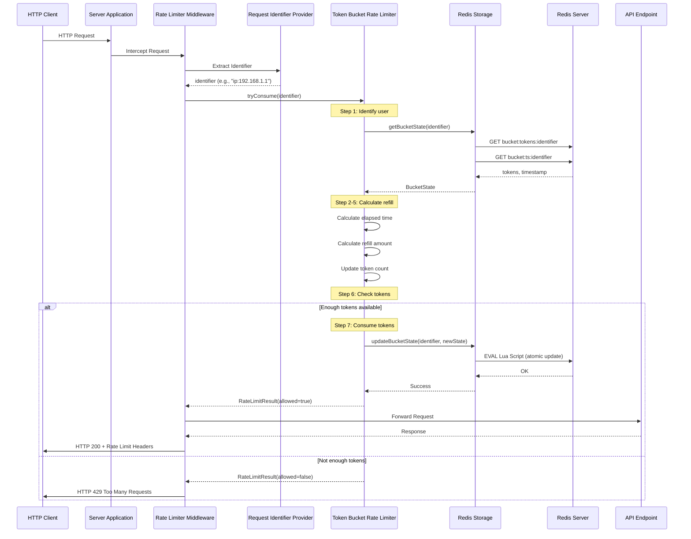

# RateLimiter_SystemDesign

```mermaid
sequenceDiagram
    participant Client as HTTP Client
    participant Server as Server Application
    participant Middleware as Rate Limiter Middleware
    participant IDProvider as Request Identifier Provider
    participant RateLimiter as Token Bucket Rate Limiter
    participant Storage as Redis Storage
    participant Redis as Redis Server
    participant API as API Endpoint
    
    Client->>Server: HTTP Request
    Server->>Middleware: Intercept Request
    Middleware->>IDProvider: Extract Identifier
    IDProvider-->>Middleware: identifier (e.g., "ip:192.168.1.1")
    
    Middleware->>RateLimiter: tryConsume(identifier)
    
    Note over RateLimiter: Step 1: Identify user
    RateLimiter->>Storage: getBucketState(identifier)
    Storage->>Redis: GET bucket:tokens:identifier
    Storage->>Redis: GET bucket:ts:identifier
    Redis-->>Storage: tokens, timestamp
    Storage-->>RateLimiter: BucketState
    
    Note over RateLimiter: Step 2-5: Calculate refill
    RateLimiter->>RateLimiter: Calculate elapsed time
    RateLimiter->>RateLimiter: Calculate refill amount
    RateLimiter->>RateLimiter: Update token count
    
    Note over RateLimiter: Step 6: Check tokens
    alt Enough tokens available
        Note over RateLimiter: Step 7: Consume tokens
        RateLimiter->>Storage: updateBucketState(identifier, newState)
        Storage->>Redis: EVAL Lua Script (atomic update)
        Redis-->>Storage: OK
        Storage-->>RateLimiter: Success
        RateLimiter-->>Middleware: RateLimitResult(allowed=true)
        
        Middleware->>API: Forward Request
        API-->>Middleware: Response
        Middleware->>Client: HTTP 200 + Rate Limit Headers
    else Not enough tokens
        RateLimiter-->>Middleware: RateLimitResult(allowed=false)
        Middleware->>Client: HTTP 429 Too Many Requests
    end
```
